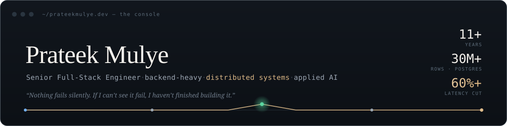

 

---

I build back-end systems that hold up under real load, and lately I bring the same discipline to applied AI. The backbone is distributed systems: event-driven services on **Kafka**, **PostgreSQL** tuned past 30M rows, clean recovery from bad input, and the service contracts that keep things honest when traffic spikes. I learned that first on financial and banking platforms where a mistake costs money.

When something breaks I want to see it immediately and recover without losing data. I would rather ship something predictable I can explain than something clever that surprises people in production.

Currently a **Senior Software Engineer in manufacturing at Agilent Technologies**, where I improve plant processes and put AI to practical use internally. Previously HG Insights, Capital One (as a consultant through Cognizant), and AurionPro Solutions. **11+ years** in all.

## Featured work

**[ChatFormula1](https://chatformula1.com)** — a single-agent agentic RAG assistant for Formula 1 *(live)*
One agent routes between a vector store and live web search, then answers over what it retrieves. Built with production hygiene: auth, rate-limiting, tests, structured logging, caching, graceful degradation, CI/CD, and Pydantic-typed state.
`LangGraph` · `Pinecone` · `Tavily` · `FastAPI` · `Pydantic`

**[FinResearch AI](https://huggingface.co/spaces/prateekmulye/FinResearchAI)** — a multi-agent equity-research system *(live)*
A LangGraph manager fans out to specialized research agents in parallel, then an analyst and a reporter write a verdict over what was retrieved. Every step emits structured JSON so the agents stay grounded instead of guessing. My submission to the SuperDataScience CP044 community project.
`multi-agent` · `LangGraph` · `Pinecone` · `RAG` · `Python`

**[slipstream-f1-strategist](https://github.com/prateekmulye/slipstream-f1-strategist)** — an event-driven race-strategy service
A reactive API publishes a request to Kafka, a consumer runs a deterministic simulation, and the result is written back exactly once. The public, NDA-free analogue of the financial-grade reliability work: bounded retry with backoff and idempotent processing, so a bad message is retried sensibly and never processed twice.
`Java 21` · `Spring WebFlux` · `Kafka` · `PostgreSQL` · `OpenTelemetry` · `Testcontainers`

## What I work on

| | |
| :-- | :-- |
| **Distributed systems** | Apache Kafka, PostgreSQL at 30M+ rows, idempotent recovery, DLQ + bounded retry, service contracts |
| **Backend** | Java (Spring Boot), Elixir (Phoenix), Python, GraphQL and REST |
| **Applied AI** | LangGraph, RAG, Pinecone, Pydantic-typed state, multi-agent orchestration |
| **Platform** | Docker, Kubernetes, Terraform, OpenTelemetry, Datadog, AWS |

---

Read the full story, and ask my site anything, at **[prateekmulye.dev](https://prateekmulye.dev)**.

